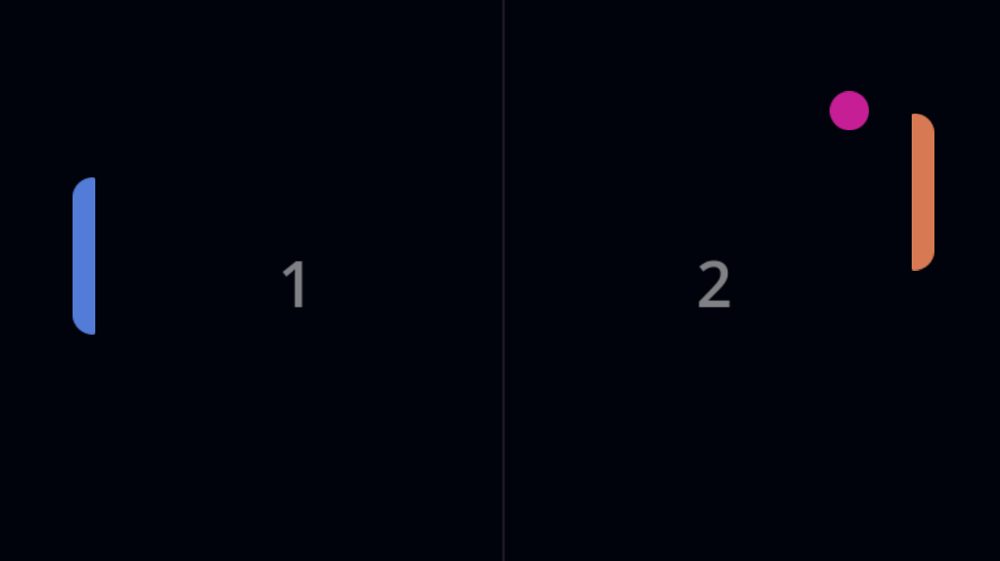

# Pong (Godot 4)

A physics-driven Pong implementation built to learn the fundamentals of the Godot Game Engine. 

Instead of relying on basic math to teleport paddles, this project utilizes Godot's 2D physics engine, Collision Layers/Masks, and a Proportional Controller (P-Controller) for the enemy AI to create smooth, jitter-free movement.

## Controls
* **Player 1 (Right):** `Up Arrow` / `Down Arrow`
* **Enemy AI (Left):** Automatically tracks the ball.

## Concepts Explored
* `CharacterBody2D` and `move_and_slide()` physics.
* Dynamic bounce angles using `CapsuleShape2D`.
* Decoupling physical bodies using Collision Layers & Masks.
* Smooth AI tracking using Proportional Gain.

